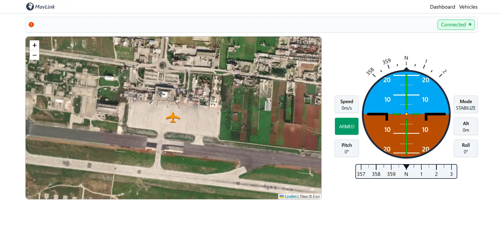
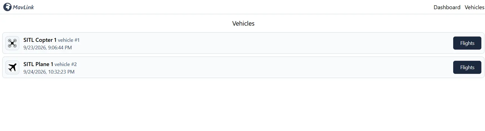
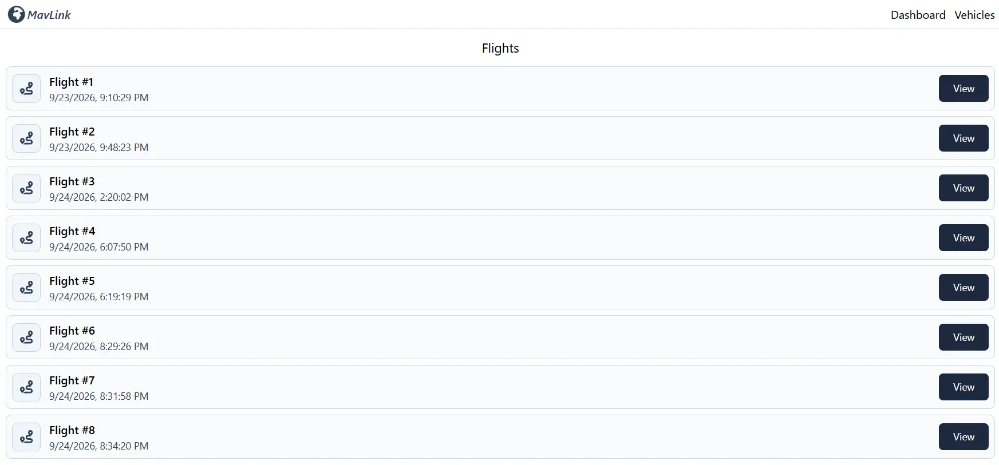
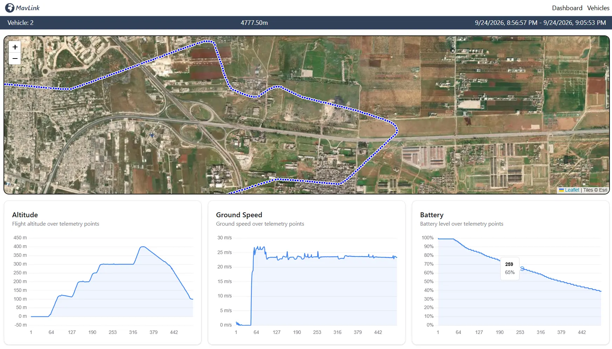
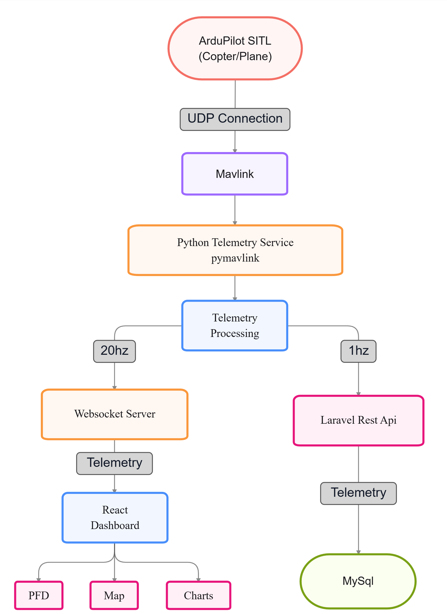
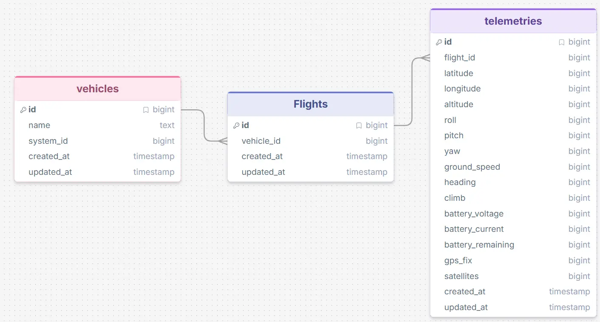

# Real-Time Drone Telemetry System

A project for monitoring ArduPilot vehicles telemetry in real time.

The system receives MAVLink telemetry from ArduPilot SITL using Python and `pymavlink`, sends real-time data to a React dashboard through WebSockets, and stores flight telemetry through a Laravel REST API and MySQL.

The system is designed to support multiple vehicle types, such as:

* ArduCopter
* ArduPlane

Each vehicle has its own `system_id` and flight history.

## Screenshots

### Dashboard



### Vehicles Page



### Flights Page



### Flight Details



## Data Flow



## Project Architecture

```text
project/
│
├── telemetry_service/
│   ├── app/
│   │   ├── mavlink.py
│   │   ├── telemetry.py
│   │   ├── api.py
│   │   └── websocket.py
│   │
│   └── main.py
│
├── backend/
│   ├── app/
│   │   ├── Http/Controllers/
│   │   │   ├── VehicleController.php
│   │   │   ├── FlightController.php
│   │   │   └── TelemetryController.php
│   │   │
│   │   └── Models/
│   │       ├── Vehicle.php
│   │       ├── Flight.php
│   │       └── Telemetry.php
│   │
│   ├── database/
│   │   ├── migrations/
│   │   └── seeders/
│   │
│   ├── routes/
│   │   └── api.php
│   │
│   └── ...
│
├── frontend/
│   ├── src/
│   │   ├── components/
│   │   ├── hooks/
│   │   └── pages/
│   │
│   └── ...
│
└── README.md
```

## Database Structure



## Api Endpoints
/vehicles
/vehicles/{vehicle}
/vehicles/{vehicle}/flights
/vehicles/{vehicle}/flights
/vehicles/{vehicle}/flights/{flight}
/vehicles/{vehicle}/flights/{flight}/telemetry
/vehicles/{vehicle}/flights/{flight}/telemetry
/vehicles/{vehicle}/flights/{flight}/telemetry/latest

A vehicle can have multiple flights, and each flight contains multiple telemetry records.

Each vehicle has a unique MAVLink `system_id`.

## Requirements

Install the following before running the project:

* Ubuntu/WSL or Linux
* ArduPilot SITL
* Python 3
* `pymavlink`
* `requests`
* `websockets`
* PHP
* Composer
* Laravel
* MySQL
* Node.js
* npm

### Python dependencies

From `telemetry_service`:

```bash
pip install pymavlink requests websockets
```

### Laravel dependencies

From `backend`:

```bash
composer install
```

Create the environment file:

```bash
cp .env.example .env
```

Generate the Laravel application key:

```bash
php artisan key:generate
```

Configure the MySQL database in `.env`, then run:

```bash
php artisan migrate --seed
```

### React dependencies

From `frontend`:

```bash
npm install
```

## Running the Project

The project consists of four main services:

```text
ArduPilot SITL
Python Telemetry Service
Laravel API
React Frontend
```

### 1. Start ArduPilot SITL

For Copter:

```bash
cd ~/ardupilot

./Tools/autotest/sim_vehicle.py -v ArduCopter --console --map
```

For Plane:

```bash
./Tools/autotest/sim_vehicle.py -v ArduPlane --console --map
```

Make sure the vehicle sends MAVLink telemetry to the port used by the Python service.

### 2. Start Laravel

```bash
cd backend

php artisan serve
```

The API will run at:

```text
http://localhost:8000
```

### 3. Start the Python Telemetry Service

```bash
cd telemetry_service

python main.py
```

The WebSocket server runs at:

```text
ws://localhost:8765
```

### 4. Start React

```bash
cd frontend

npm run dev
```

The frontend will normally run at:

```text
http://localhost:5173
```

## Telemetry Rates

```text
MAVLink
   |
   +----> WebSocket ----> React
   |          20 Hz
   |
   +----> Laravel -----> MySQL
              1 Hz
```

WebSocket telemetry is used for real-time dashboard updates.

Laravel/MySQL is used for storing flight history.

## Map

The project currently uses:

* Leaflet
* React Leaflet
* OpenStreetMap tiles

The map displays the vehicle position, flight path, and telemetry points.

## Main Technologies

| Component               | Technology              |
| ----------------------- | ----------------------- |
| Simulation              | ArduPilot SITL          |
| Protocol                | MAVLink                 |
| Telemetry               | Python / pymavlink      |
| Real-time communication | WebSocket               |
| Frontend                | React                   |
| Maps                    | Leaflet / OpenStreetMap |
| Charts                  | Chart.js                |
| Backend                 | Laravel                 |
| Database                | MySQL                   |
| API                     | REST                    |

## Project Goal

The main goal of this project is to learn and demonstrate real-time drone telemetry processing, MAVLink communication, WebSocket communication, REST APIs, data persistence, and frontend visualization in a full-stack application.
